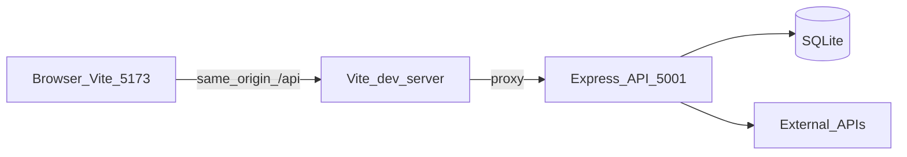

# Repository structure

High-level layout of FinWise AI and how HTTP traffic flows in development.

## Request flow (development)

In dev, the browser loads the Vite app on port **5173**. Same-origin requests to **`/api/*`** are proxied to the Express API on port **5001** (`client/vite.config.js`). The API reads/writes SQLite and may call external services (SMTP, OpenAI, Seylan/MPGS) when configured.

In **production**, there is no Vite proxy: the static SPA and the API must be deployed so the browser can reach `/api` on the API host (or a reverse proxy combines both under one origin).

## Server route modules

Mounted from [`server/src/app.js`](../server/src/app.js):

| Mount path | Module |
|------------|--------|
| `/api/auth` | [`authRoutes.js`](../server/src/routes/authRoutes.js) |
| `/api/mock` | [`mockRoutes.js`](../server/src/routes/mockRoutes.js) |
| `/api/alerts` | [`alertRoutes.js`](../server/src/routes/alertRoutes.js) |
| `/api/bank` | [`bankRoutes.js`](../server/src/routes/bankRoutes.js) |
| `/api/payment` | [`paymentRoutes.js`](../server/src/routes/paymentRoutes.js) |
| `/api/savings` | [`savingsRoutes.js`](../server/src/routes/savingsRoutes.js) |
| `/api/intelligence` | [`intelligenceRoutes.js`](../server/src/routes/intelligenceRoutes.js) |
| `/api/ai` | [`aiRoutes.js`](../server/src/routes/aiRoutes.js) and [`aiMoneyAdviceRoutes.js`](../server/src/routes/aiMoneyAdviceRoutes.js) |

Control-plane JSON endpoints (defined in `app.js`, not separate route files): `GET /api/health`, `GET /api/meta`.

## Client entry

- [`client/src/main.jsx`](../client/src/main.jsx) — React bootstrap
- [`client/src/App.jsx`](../client/src/App.jsx) — routing and shell layout
